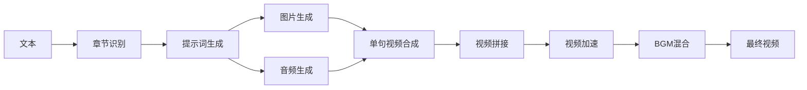

# 🎬 AICG - AI驱动的智能视频创作平台

<div align="center">

**将长文本自动转换为高质量图文解说视频的一站式解决方案**

[](LICENSE)
[](https://www.python.org/downloads/)
[](https://nodejs.org/)
[](https://fastapi.tiangolo.com/)
[](https://vuejs.org/)

[功能演示](#-产品演示) • [功能特性](#-核心功能) • [快速开始](#-快速开始) • [技术架构](#-技术架构)

</div>

---

## 📺 产品演示

<div align="center">

### 完整工作流程展示

#### 1️⃣ 项目管理与章节识别

*上传文档 → 智能章节识别 → 可视化编辑*

#### 2️⃣ 导演引擎 - 批量生成素材

*批量生成提示词 → AI绘画 → TTS配音 → 实时预览*

#### 3️⃣ 单句精细调整

*查看句子详情 → 重新生成 → 替换素材*

#### 4️⃣ 视频合成与配置

*配置参数 → 选择BGM → 一键生成视频*

</div>

---

## 🌟 项目亮点

### 💰 极致性价比
通过灵活的第三方API集成，实现**低至0.04元/张图片**的成本控制，让视频创作不再昂贵。

### 🎯 全自动化流程
从文本上传到视频生成，**一键完成**：
- 📝 智能章节识别
- 🎨 AI图片生成
- 🗣️ 情感化语音合成
- 🎬 自动视频剪辑
- 📊 精准字幕同步

### ⚡ 高效异步架构
基于Celery的异步任务处理，支持：
- 🚀 高并发批量生成
- 💾 智能增量缓存
- 📈 实时进度追踪
- 🔄 断点续传

### 🎛️ 专业级视频控制
- **Ken Burns效果**：动态缩放和平移
- **BGM混合**：可配置音量的背景音乐
- **视频加速**：0.5x-2.0x速度调整
- **LLM字幕纠错**：智能修正识别错误
- **多分辨率支持**：竖屏/横屏/方形

---

## ✨ 核心功能

### 📚 智能内容管理

<table>
<tr>
<td width="50%">

#### 📂 项目与章节管理
- ✅ 支持TXT、DOCX、PDF、EPUB等多格式
- ✅ 智能章节识别与解析
- ✅ 可视化章节编辑器
- ✅ 章节合并/拆分/忽略
- ✅ 实时预览与调整

</td>
<td width="50%">

#### 🎯 导演引擎（Director Engine）
- ✅ 批量生成提示词
- ✅ 批量生成图片
- ✅ 批量生成音频
- ✅ 单句精细调整
- ✅ 素材预览与替换

</td>
</tr>
</table>

### 🎨 AI素材生成

<table>
<tr>
<td width="33%">

#### 🖼️ 图片生成
- Flux系列模型
- SDXL系列模型
- Sora_Image（低成本）
- 自定义模型支持
- 风格一致性控制

</td>
<td width="33%">

#### 🎤 语音合成
- 硅基流动 index-tts2
- 情感丰富的中文配音
- 多种音色选择
- 自然语音节奏
- 高保真音质

</td>
<td width="33%">

#### 🤖 LLM集成
- GPT-4o系列
- Claude 3.5系列
- DeepSeek系列
- 自定义模型
- 字幕智能纠错

</td>
</tr>
</table>

### 🎬 专业视频合成

#### 🎥 视频生成特性

| 功能 | 说明 | 配置项 |
|------|------|--------|
| **分辨率** | 竖屏(9:16)、横屏(16:9)、方形(1:1) | ✅ 可配置 |
| **帧率** | 24/30/60 FPS | ✅ 可配置 |
| **Ken Burns效果** | 动态缩放+平移，电影级运镜 | ✅ 可配置速度 |
| **字幕样式** | 字体大小、颜色、位置 | ✅ 可配置 |
| **BGM混合** | 背景音乐自动循环与混合 | ✅ 可配置音量(0-50%) |
| **视频加速** | 0.5x-2.0x速度调整，保持音调 | ✅ 可配置 |
| **LLM纠错** | 智能修正字幕错别字 | ✅ 可选启用 |

#### 🔧 技术亮点



**关键优化**：
- ✅ **字幕同步保护**：严格验证LLM纠错词数，防止时间轴错位
- ✅ **高效加速策略**：在最终视频应用速度，避免单句重复编码
- ✅ **智能BGM处理**：自动循环短BGM，截断长BGM
- ✅ **增量缓存**：已生成的图片和音频智能复用

### 🔐 API密钥管理

- ✅ 多供应商支持（OpenAI、Anthropic、硅基流动、自定义）
- ✅ 多密钥配置与切换
- ✅ 密钥状态监控
- ✅ 用量统计（即将推出）

### 📦 BGM资源管理

- ✅ BGM上传与管理
- ✅ 音频时长自动识别
- ✅ 预签名URL访问
- ✅ 批量删除

---

## 🚀 快速开始

### 📋 前置要求

| 工具 | 版本要求 | 说明 |
|------|---------|------|
| **Node.js** | >= 18.0.0 | 前端运行环境 |
| **Python** | >= 3.11 | 后端运行环境 |
| **uv** | 最新版 | Python包管理器 |
| **FFmpeg** | 最新版 | 视频处理核心 |
| **Docker** | 最新版 | 基础设施服务 |

### 🔑 API平台注册

本项目依赖第三方AI模型，需要注册以下平台：

1. **[推荐] 硅基流动** (TTS/大模型)
   - 注册链接：[https://cloud.siliconflow.cn/i/63zI7Mdc](https://cloud.siliconflow.cn/i/63zI7Mdc)
   - 用途：高质量中文TTS、大模型服务

2. **[低成本] 第三方中转平台** (Sora_Image)
   - 注册链接：[https://api.vectorengine.ai/register?aff=YVx7](https://api.vectorengine.ai/register?aff=YVx7)
   - 用途：低成本图片生成（约0.04元/张）
   - ⚠️ **注意**：按需充值，用多少充多少

### 📦 安装步骤

#### 1. 安装系统依赖

**FFmpeg (视频处理核心)**

```bash
# Windows (Chocolatey)
choco install ffmpeg

# Windows (Scoop)
scoop install ffmpeg

# macOS
brew install ffmpeg

# Ubuntu/Debian
sudo apt update && sudo apt install ffmpeg

# CentOS/RHEL
sudo yum install epel-release && sudo yum install ffmpeg
```

**uv (Python包管理器)**

```bash
# macOS/Linux
curl -LsSf https://astral.sh/uv/install.sh | sh

# 或使用pip
pip install uv
```

#### 2. 配置环境变量

```bash
# 复制环境变量模板
cp .env.example .env

# 编辑.env文件，填入配置
# - API密钥
# - 数据库连接
# - MinIO配置
# 等
```

#### 3. 启动服务

**方式一：一键启动（推荐）**

```bash
# 1. 启动基础设施 (PostgreSQL, Redis, MinIO)
./scripts/start.sh

# 2. 启动后端API服务（新终端）
cd backend
uv sync
alembic upgrade head
uv run uvicorn src.main:app --reload --host 0.0.0.0 --port 8000

# 3. 启动Celery Worker（新终端）
cd backend
uv run celery -A src.tasks.task worker --loglevel=info

# 4. 启动前端服务（新终端）
cd frontend
npm install
npm run dev
```

**方式二：Docker Compose**

```bash
# 启动所有服务
docker-compose up -d

# 查看服务状态
docker-compose ps

# 查看日志
docker-compose logs -f
```

#### 4. 验证安装

访问以下地址确认服务正常:

- 🌐 **前端应用**: http://localhost:3000
- 📚 **API文档**: http://localhost:8000/docs
- 📦 **MinIO控制台**: http://localhost:9001 (minioadmin/minioadmin123)

#### 5. GPU加速配置 (可选)

如果您有NVIDIA GPU并希望加速视频字幕生成(faster-whisper),可以启用GPU支持:

**适用环境**: Linux / WSL

**前置条件**:
- NVIDIA GPU (支持CUDA)
- 已安装CUDA驱动
- 当前项目安装命令 `uv pip install .[gpu] -i https://pypi.tuna.tsinghua.edu.cn/simple`

**配置步骤**:

1. **设置CUDA动态库路径**

   激活虚拟环境后,设置环境变量:
   ```bash
   source .venv/bin/activate
   export LD_LIBRARY_PATH="<PROJECT_PATH>/.venv/lib/python3.12/site-packages/nvidia/cublas/lib:<PROJECT_PATH>/.venv/lib/python3.12/site-packages/nvidia/cudnn/lib:$LD_LIBRARY_PATH"
   ```
   
   将 `<PROJECT_PATH>` 替换为实际项目路径。

2. **自动加载配置 (推荐)**

   将以下内容追加到 `.venv/bin/activate`,每次激活虚拟环境自动启用GPU:
   ```bash
   export LD_LIBRARY_PATH="<PROJECT_PATH>/.venv/lib/python3.12/site-packages/nvidia/cublas/lib:<PROJECT_PATH>/.venv/lib/python3.12/site-packages/nvidia/cudnn/lib:$LD_LIBRARY_PATH"
   ```

3. **修改Whisper服务配置**

   编辑 `backend/src/services/faster_whisper_service.py`:
   ```python
   class WhisperTranscriptionService:
       def __init__(self, model_size="small", device="cuda", compute_type="float32"):
           """初始化语音识别服务"""
           logger.info(f"🔄 正在加载 Whisper 模型: {model_size} ...")
           self.model = WhisperModel(model_size, device=device, compute_type=compute_type)
           self.cc = OpenCC("t2s")
           logger.info(f"✅ 模型加载完成")
   ```
   
   将 `device` 参数从 `"cpu"` 改为 `"cuda"`,`model_size` 可根据显存调整(tiny/base/small/medium/large)。

**性能提升**: GPU加速可将字幕生成速度提升3-10倍,具体取决于GPU型号。

#### 6. Bilibili发布工具配置 (可选)

如果需要将生成的视频发布到Bilibili,需要部署biliup-rs工具:

**下载biliup-rs**:

```bash
# Linux/WSL
cd backend
mkdir -p bin
cd bin
wget https://github.com/ForgQi/biliup-rs/releases/latest/download/biliup-linux-amd64
mv biliup-linux-amd64 biliup
chmod +x biliup

# Windows (PowerShell)
cd backend
New-Item -ItemType Directory -Force -Path bin
cd bin
# 手动下载: https://github.com/ForgQi/biliup-rs/releases/latest/download/biliup.exe
```

**创建Cookie存储目录**:

```bash
cd backend
mkdir -p data/bilibili_cookies
```

**验证安装**:

```bash
# Linux/WSL
./bin/biliup --version

# Windows
.\bin\biliup.exe --version
```

**使用说明**:
1. 通过API `/api/v1/bilibili/login/qrcode` 扫码登录B站
2. 调用 `/api/v1/bilibili/publish` 发布视频到B站
3. 支持自定义分区、标签、封面等配置

详细文档参见: [Bilibili发布集成方案](docs/bilibili_integration_plan.md)

---

## 🏗️ 技术架构

### 后端技术栈

```
FastAPI + SQLAlchemy + Celery + PostgreSQL + Redis + MinIO
```

- **FastAPI**: 高性能异步Web框架
- **SQLAlchemy**: ORM与数据库管理
- **Celery**: 分布式异步任务队列
- **PostgreSQL**: 主数据库
- **Redis**: 缓存与消息队列
- **MinIO**: 对象存储（图片、音频、视频）

### 前端技术栈

```
Vue 3 + Element Plus + Pinia + Vite
```

- **Vue 3**: 渐进式JavaScript框架
- **Element Plus**: 企业级UI组件库
- **Pinia**: 状态管理
- **Vite**: 下一代前端构建工具

### 项目结构

```
aicon2/
├── backend/                 # Python/FastAPI后端
│   ├── src/
│   │   ├── api/            # API路由
│   │   ├── models/         # 数据模型
│   │   ├── services/       # 业务逻辑
│   │   ├── tasks/          # Celery任务
│   │   └── utils/          # 工具函数
│   ├── alembic/            # 数据库迁移
│   └── tests/              # 测试
├── frontend/               # Vue.js前端
│   ├── src/
│   │   ├── components/     # Vue组件
│   │   ├── composables/    # 组合式API
│   │   ├── services/       # API服务
│   │   ├── stores/         # Pinia状态
│   │   └── views/          # 页面视图
│   └── public/             # 静态资源
├── docs/                   # 文档与媒体资源
│   └── media/              # 产品演示GIF
├── scripts/                # 运维脚本
├── docker-compose.yml      # Docker编排
└── .env.example           # 环境变量模板
```

---

## 📖 使用指南

### 1. 项目管理
- 上传文本文件（TXT/DOCX/PDF/EPUB）
- 自动章节识别与解析
- 编辑章节内容

### 2. 素材生成
- 配置API密钥
- 批量生成提示词
- 批量生成图片和音频
- 预览与调整

### 3. 视频合成
- 配置视频参数（分辨率、帧率、字幕样式）
- 选择BGM（可选）
- 设置视频速度
- 启用LLM字幕纠错（可选）
- 一键生成视频

---

## 🔧 常用命令

| 命令 | 描述 |
|------|------|
| `docker-compose up -d` | 启动基础设施 |
| `docker-compose down` | 停止基础设施 |
| `docker-compose logs -f` | 查看日志 |
| `cd backend && uv sync` | 安装Python依赖 |
| `cd backend && alembic upgrade head` | 数据库迁移 |
| `cd frontend && npm install` | 安装Node依赖 |
| `cd frontend && npm run dev` | 启动前端开发服务器 |

---

## 🎯 成本优化建议

### 推荐配置（极致性价比）

| 步骤 | 推荐服务 | 成本 |
|------|---------|------|
| **提示词生成** | GPT-4o-mini / DeepSeek | ~¥0.001/句 |
| **图片生成** | Sora_Image（中转平台） | ~¥0.04/张 |
| **语音合成** | 硅基流动 index-tts2 | ~¥0.02/句 |

**示例成本计算**（100句视频）：
- 提示词：100 × ¥0.001 = ¥0.1
- 图片：100 × ¥0.04 = ¥4.0
- 语音：100 × ¥0.02 = ¥2.0
- **总计：约¥6.1**

---

## 📄 License

MIT License - 详见 [LICENSE](LICENSE) 文件

---

## 🙏 致谢

感谢以下开源项目和服务：

- [FastAPI](https://fastapi.tiangolo.com/)
- [Vue.js](https://vuejs.org/)
- [Element Plus](https://element-plus.org/)
- [FFmpeg](https://ffmpeg.org/)
- [Celery](https://docs.celeryq.dev/)
- [硅基流动](https://cloud.siliconflow.cn/)

---

<div align="center">

**⭐ 如果这个项目对你有帮助，请给个Star！**

Made with ❤️ by AICG Team

</div>