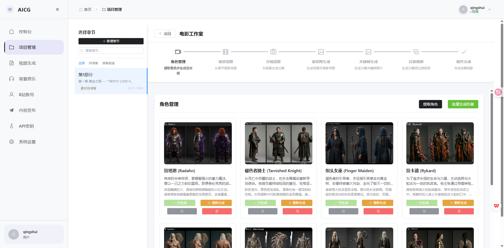
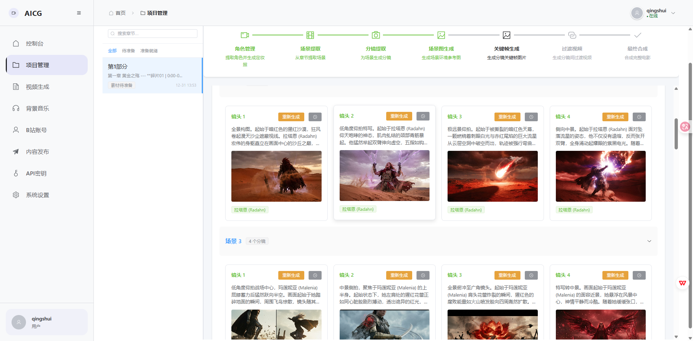
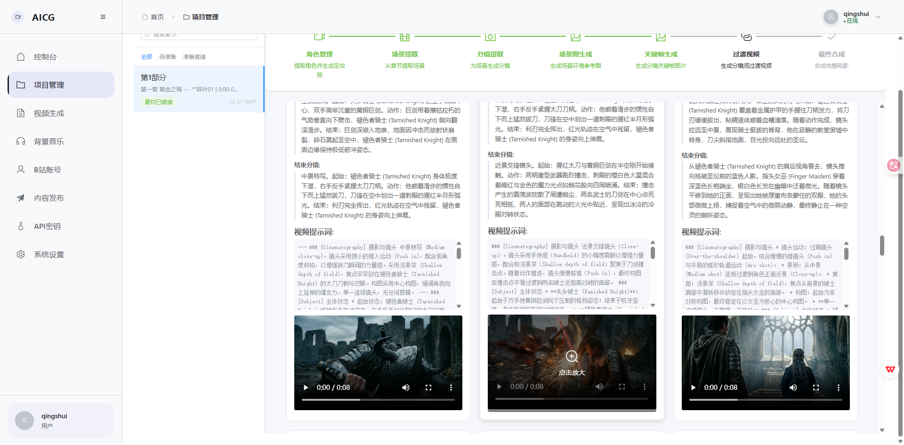
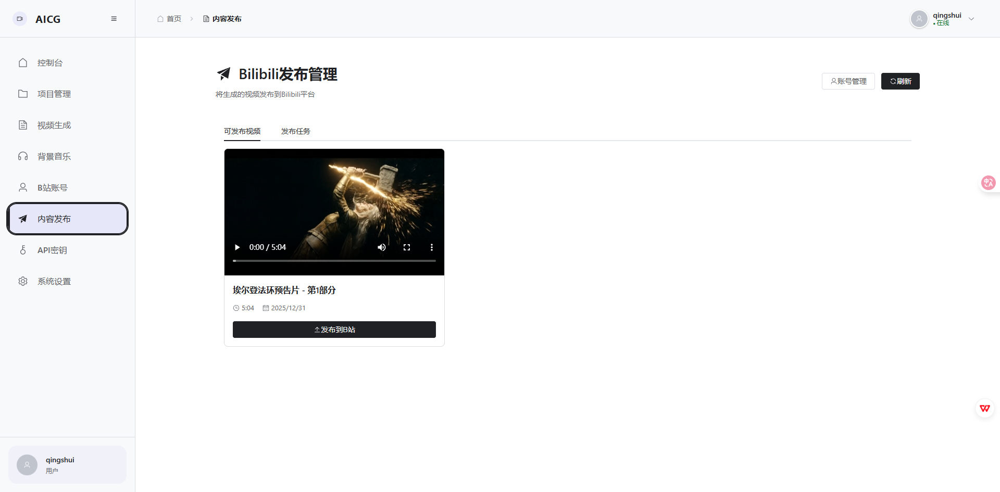

# AICG 内容分发平台

> 🎬 **AI驱动的智能内容创作与分发平台** - 从文字到视频，一站式AI内容生产解决方案

[](LICENSE)
[](https://www.python.org/)
[](https://vuejs.org/)
[](https://fastapi.tiangolo.com/)

## 🎥 成果展示

**全自动AI电影生成演示** - 无需手动调整提示词和关键帧

[](https://www.bilibili.com/video/BV1DpvaB8EDE/?vd_source=2da8614f110387a6fe068f446424c748)

[](https://www.bilibili.com/video/BV1w3igBpEXo)

---

## ✨ 核心功能

### 🎥 AI 电影工作室 (Movie Studio)
**革命性的全自动电影制作流程，将文学作品直接转化为视听大片。**
- **🔍 智能剧本解析**：利用 LLM 深度理解文本，自动提取关键角色、高密度电影场景及精细分镜（Shot），并智能生成导演级的景别、构图与灯光描述。
- **🎭 角色一致性 (Character Consistency)**：内置视觉一致性引擎，通过角色定妆照与参考图技术，确保同一角色在不同分镜中容貌高度统一，解决 AI 视频“换脸”痛点。
- **🎬 动态过渡生成**：集成先进的视频生成模型，为相邻分镜自动创建平滑的过渡视频（Transition），支持推拉摇移等电影感镜头运动。
- **🎵 视听一键合成**：背景音乐（BGM）管理、合成背景音效，一键输出符合主流视频平台标准的电影短片。

### 🎨 AI 图文说生成器 (Picture Narration)
**为短视频创作者打造的极速生产力工具。**
- **📖 智能章节识别**：自动解析长文本结构，实现段落智能分割与核心语义提取。
- **🎯 导演引擎 (Director Engine)**：AI 自动为每一段话匹配最适合的视觉提示词（Prompts）与构图设计。
- **🖼️ 批量素材生产**：支持多模型并发调用，批量生成高质量配图与极具情感表现力的 TTS 语音。
- **🎞️ 自动渲染合成**：图片、语音、字幕与背景音乐实时对齐，分钟级产出可直接发布的短视频。

### 🚀 自动化分发
- **📺 B站一键发布**：深度集成 Bilibili API，支持视频自动上传、标题摘要生成及标签智能推荐，打通创作到分发的最后一公里。

---

## 📸 功能截图

### 角色管理


### 场景图生成


### 关键帧生成


### 过渡视频


### 发布管理


---

## 🚀 快速开始 (Docker部署)

使用Docker是最简单、最快速的部署方式。

```bash
# 1. 克隆项目
git clone https://github.com/869413421/aicon.git
cd aicon

# 2. 配置环境变量
cp .env.production.example .env.production
# 编辑 .env.production, 修改必要配置

# 3. 启动所有服务
docker-compose -f docker-compose.prod.yml up -d

# 4. 访问应用
# 前端: http://localhost
# 后端API: http://localhost:8000
```

📖 **详细部署文档**: 查看 [Docker部署指南](docs/docker-deployment-guide.md)

---

## 📖 使用教程

### 1. 获取 API Key
本系统支持多种 AI 模型,推荐使用中转站以获得更低成本和更强性能:
- **注册地址**: [https://api.aiconapi.me/](https://api.aiconapi.me/)
- 注册并购买额度后,在令牌(API Key)页面创建一个新的 Key。
- 请按需购，用多少买多少。

### 2. 配置系统 API Key
进入系统后台,在 **API密钥管理** 页面点击添加:
- **供应商/类型**: 选择 `自定义`
- **API密钥**: 填入你在中转站获取的令牌
- **Base URL**: `https://api.aiconapi.me/v1`
> [!IMPORTANT]
> **重点**: Base URL 结尾 **不可以带斜杠** (即不要写成 `v1/`),否则请求会报错。

### 3. 开始创作 AI 电影
1. **新建项目**: 在项目管理页面点击“新建项目”。
2. **导入文本**: 建议选择 **“以章的方式”** 导入小说或剧本内容。
3. **进入工作室**: 项目创建完成后,点击进入项目详情,选择 **“电影工作室”** 标签。
4. **一键生成**: 按照角色提取 -> 场景提取 -> 分镜生成 -> 视频合成的顺序,开启你的创作之旅。

---

## 📄 许可证
本项目采用 Apache License 2.0 许可证 - 详见 [LICENSE](LICENSE) 文件