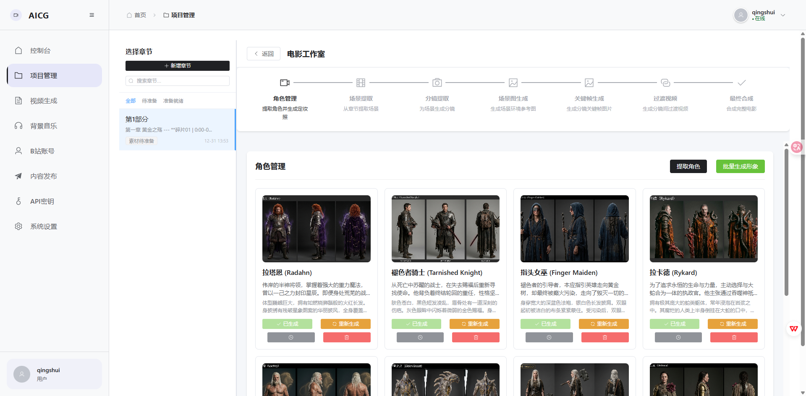
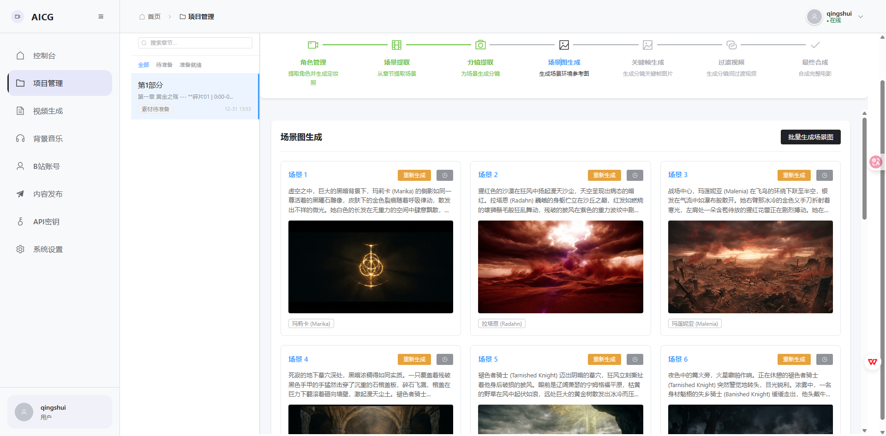
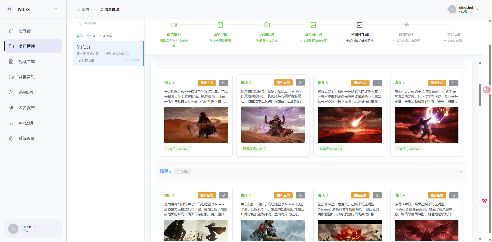
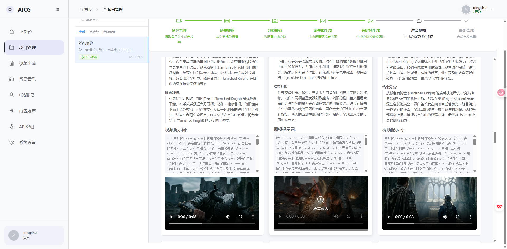
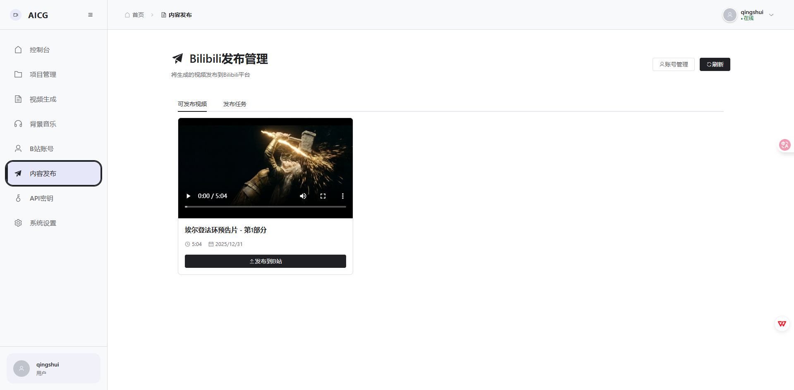

# AICG 内容分发平台

> 🎬 **AI驱动的智能内容创作与分发平台** - 从文字到视频，一站式AI内容生产解决方案
>
> 🚀 **官方在线站点现已上线内测：[https://aicon-studio.com/](https://aicon-studio.com/)**
>
> 👨‍💻 **补充说明**：本人目前在广州地区求职中，具备丰富的 AI 应用开发经验包括不限Agent，RAG等相关技术，欢迎相关技术岗位与合作机会交流。

---

## 📅 更新日志
### [2026-04-03]
- 🧠 **新增无限画布（Canvas）工作台**: 支持在同一画布中自由组织文本、图片、视频节点，通过连线表达上下游关系，把灵感梳理、提示词编排、素材生成和版本选择放到一个统一工作区完成。
- 🖼️ **支持节点引用生成**: 文本/图片/视频节点可直接引用上游文本内容或图片结果，生成时自动提取可用上下文与参考图，减少手工复制 prompt 的成本。
- 🕘 **支持生成历史回看与切换**: 图片和视频节点内置历史抽屉，可查看每次生成结果并一键应用到当前节点，便于快速比较不同模型和提示词版本。

### [2026-02-28]
- 🖼️ **新增Nano Banana 2图像模型**: 谷歌最新Nano Banana 2 以主流价格提供更高高质量的图片生成，生成时选择 `gemini-3.1-flash-image-preview`即可。
- 📺**新增gemini-3.1-pro文本模型**：Gemini 3.1 是谷歌迄今为止最智能的模型系列，以先进的推理能力为基础。

### [2026-01-23]
- 🐳 **发布 Docker 镜像 v1.1.0**: 正式构建并发布版本号为 `v1.1.0` 的全功能容器镜像。
- 🐞 **修复模型列表加载问题**: 修复了角色管理页面中模型列表类型加载错误的 Bug，现在能准确识别并加载文本/图片模型列表。
- 🎬 **新增低价视频模型**: `custom` (couston) 供应商新增一系列 Veo 3.1 视频模型支持（高质量/快速模式/4K/叠图系列），大幅降低视频生成成本。

### [2026-01-15]
- 🚀 **官方在线站点上线**: AICON 商业项目版本已上线内测，访问 [aicon-studio.com](https://aicon-studio.com/) 立即体验。
- 🎭 **角色参考图功能**: 支持上传参考图，让 AI 精准控制生成你喜欢的任何角色，角色一致性再进化。
- 📺 **高级模型支持**: 新增 VEO3.1 4K 超高清模型支持，带来顶级的影视画质。
- 📖 **文档更新**: 完善了 README 说明，增加了更新日志和交流群组。

---

## 👥 交流与支持

扫码加入 **AICON 内测交流群**, 获取最新动态、功能首发及技术支持。**我们诚邀各路创作者加入，共同打造最强 AI 电影工具！**


---

[](LICENSE)
[](https://www.python.org/)
[](https://vuejs.org/)
[](https://fastapi.tiangolo.com/)

## 🎥 成果展示

**全自动AI电影生成演示** - 无需手动调整提示词和关键帧

[](https://www.bilibili.com/video/BV1DpvaB8EDE/?vd_source=2da8614f110387a6fe068f446424c748)

[](https://www.bilibili.com/video/BV1w3igBpEXo)

---

## ✨ 核心功能

### 🎥 AI 电影工作室 (Movie Studio)
**革命性的全自动电影制作流程，将文学作品直接转化为视听大片。**
- **🔍 智能剧本解析**：利用 LLM 深度理解文本，自动提取关键角色、高密度电影场景及精细分镜（Shot），并智能生成导演级的景别、构图与灯光描述。
- **🎭 角色一致性 (Character Consistency)**：内置视觉一致性引擎，通过角色定妆照与参考图技术，确保同一角色在不同分镜中容貌高度统一，解决 AI 视频“换脸”痛点。
- **🎬 动态过渡生成**：集成先进的视频生成模型，为相邻分镜自动创建平滑的过渡视频（Transition），支持推拉摇移等电影感镜头运动。
- **🎵 视听一键合成**：背景音乐（BGM）管理、合成背景音效，一键输出符合主流视频平台标准的电影短片。

### 🎨 AI 图文说生成器 (Picture Narration)
**为短视频创作者打造的极速生产力工具。**
- **📖 智能章节识别**：自动解析长文本结构，实现段落智能分割与核心语义提取。
- **🎯 导演引擎 (Director Engine)**：AI 自动为每一段话匹配最适合的视觉提示词（Prompts）与构图设计。
- **🖼️ 批量素材生产**：支持多模型并发调用，批量生成高质量配图与极具情感表现力的 TTS 语音。
- **🎞️ 自动渲染合成**：图片、语音、字幕与背景音乐实时对齐，分钟级产出可直接发布的短视频。

### 🧩 无限画布工作台 (Canvas)
**把想法、提示词、参考图和生成结果组织在同一个可视化工作流里。**
- **📝 多节点协同创作**：支持文本、图片、视频三类节点自由摆放与编辑，适合做创意拆解、镜头规划和素材流转。
- **🔗 连线驱动上下文引用**：节点之间可建立依赖关系，后续节点可以直接引用前序文本内容或图片结果作为生成上下文。
- **🖼️ 引用图片与风格参考**：图片/视频节点支持引用上游图片、上传参考图或叠加风格参考，方便做角色延续、画面风格统一和视频首帧控制。
- **📚 历史版本管理**：每个生成节点都可以查看历史结果、对比效果并一键切换当前版本，适合快速迭代 prompt 和模型参数。
- **⚡ 轻量级画布预览**：画布打开时按节点类型返回轻量快照，兼顾大画布加载速度与节点级实时编辑体验。

### 🚀 自动化分发
- **📺 B站一键发布**：深度集成 Bilibili API，支持视频自动上传、标题摘要生成及标签智能推荐，打通创作到分发的最后一公里。

---

## 📸 功能截图

### 角色管理


### 场景图生成


### 关键帧生成


### 过渡视频


### 发布管理


---

## 🚀 快速开始 (Docker部署)

使用Docker是最简单、最快速的部署方式。

```bash
# 1. 克隆项目
git clone https://github.com/869413421/aicon.git
cd aicon

# 2. 配置环境变量
cp .env.production.example .env.production
# 编辑 .env.production, 修改必要配置

# 3. 启动所有服务
docker-compose -f docker-compose.prod.yml up -d

# 4. 访问应用
# 前端: http://localhost
# 后端API: http://localhost:8000
```

📖 **详细部署文档**: 查看 [Docker部署指南](docs/docker-deployment-guide.md)

---

## 📖 使用教程

### 1. 获取 API Key
本系统支持多种 AI 模型,推荐使用中转站以获得更低成本和更强性能:
- **注册地址**: [https://api.aiconapi.me/](https://api.aiconapi.me/)
- 注册并购买额度后,在令牌(API Key)页面创建一个新的 Key。
- 请按需购，用多少买多少。

### 2. 配置系统 API Key
进入系统后台,在 **API密钥管理** 页面点击添加:
- **供应商/类型**: 选择 `自定义`
- **API密钥**: 填入你在中转站获取的令牌
- **Base URL**: `https://api.aiconapi.me/v1`
> [!IMPORTANT]
> **重点**: Base URL 结尾 **不可以带斜杠** (即不要写成 `v1/`),否则请求会报错。

### 3. 开始创作 AI 电影
1. **新建项目**: 在项目管理页面点击“新建项目”。
2. **导入文本**: 建议选择 **“以章的方式”** 导入小说或剧本内容。
3. **进入工作室**: 项目创建完成后,点击进入项目详情,选择 **“电影工作室”** 标签。
4. **一键生成**: 按照角色提取 -> 场景提取 -> 分镜生成 -> 视频合成的顺序,开启你的创作之旅。

---

## 📄 许可证
本项目采用 Apache License 2.0 许可证 - 详见 [LICENSE](LICENSE) 文件
